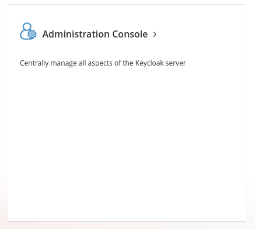

# Installation instructions Open Anatomy Explorer for University of Antwerp

The Open Anatomy Explorer is a containerized application meant to be deployed in a [Kubernetes](https://kubernetes.io/) cluster.


## Angular production environment update

You will need to modify the production environment configuration [file](frontend/src/environments/environment.prod.ts) (frontend/src/environments/environment.prod.ts) for Angular with your hostname.

```ts
export const environment = {
  production: true,
  frontend_url: 'https://opanex.discover.ilabt.imec.be', // TODO
  keycloak_url: 'https://opanex.discover.ilabt.imec.be', // TODO
  keycloak_realm: 'opanex',
  keycloak_clientId: 'opanex-frontend',
  backend_root: '/api',
  DEFAULT_PAGE_SIZE: 100
};
```

## Container images

The application is containerized and container images need to be build.

### Container image prerequisites

- Docker
- Java (e.g., OpenJDK 17+)

### Container image building

Image build scripts are provided for the front- and backend (in the `frontend` and `backend` folder). Open the `container-image-push.sh` files and update the environment variables with your container registry information (e.g., the public DockerHub, or an internal UA container registry).

```bash
vim container-image-push.sh # update env

chmod +x container-image-push.sh

bash container-image-push.sh
```

You will need to do this twice, once for the backend and once for the frontend.

## Cluster prerequisites

The Kubernetes cluster where Opanex will be deployed needs to have a working [Ingress Controller](https://kubernetes.io/docs/concepts/services-networking/ingress-controllers/). In our deployment we opted to use Traefik as ingress controller.

It is preferred that the cluster supports dynamic persistent volume provisioning using [Storage Classes](https://kubernetes.io/docs/concepts/storage/storage-classes/). If dynamic persistent volume provisioning is not supported, the Helm charts will need to be modified to use the correct persistent volume using a persistent volume claim.

## Opanex deployment

[Helm charts](https://helm.sh/) are used to facilitate the deployment of the Open Anatomy Explorer to a Kubernetes cluster. The Helm charts can be found in the [deployment directory](./deployment/). Modify these Helm charts `values.yaml` files as necessary (e.g., hostname, container image path, etc.). Values that **need** to be modified will be indicated by a `TODO`.


**Deploy MongoDB** using Helm. Adapt `values.yml` as necessary.

```
helm install -f deployment/backend/mongodb/values.yml -n opanex --create-namespace opanex-mongodb oci://registry-1.docker.io/bitnamicharts/mongodb
```

**Deploy Keycloak** using Helm. Adapt `values.yml` as necessary.

```
helm install -f deployment/backend/keycloak/values.yml -n opanex --create-namespace opanex-keycloak oci://registry-1.docker.io/bitnamicharts/keycloak
```

### Keycloak configuration

Navigate to the Keycloak administration console (`https://hostname/auth`) in a browser and click on Administration Console.



Login with the username and password you set in the Keycloak Helm values.

#### Realm

Follow this guide to create the `opanex` realm: [https://www.keycloak.org/docs/latest/server_admin/#proc-creating-a-realm_server_administration_guide](https://www.keycloak.org/docs/latest/server_admin/#proc-creating-a-realm_server_administration_guide).

#### OIDC clients

Follow this guide to create two OIDC clients in the `opanex` realm: [https://www.keycloak.org/docs/latest/server_admin/#proc-creating-oidc-client_server_administration_guide](https://www.keycloak.org/docs/latest/server_admin/#proc-creating-oidc-client_server_administration_guide).

The first client is `opanex-backend`, the second one is `opanex-frontend`.

Configure these clients so that the `valid redirect URIs` is set to `https://hostname/*` (e.g., `https://opanex.discover.ilabt.imec.be/*`).

Make sure `Client authentication` is set to `On` in the `opanex-backend` client, and make sure it is set to `Off` in the `opanex-frontend` client.

Copy the `Client secret` of `opanex-backend` by going to the `Credentials` tab ([https://www.keycloak.org/docs/latest/server_admin/#_client-credentials](https://www.keycloak.org/docs/latest/server_admin/#_client-credentials)). Paste this secret in the `opanex-backend` Helm `values.yaml` file next to `QUARKUS_OIDC_CREDENTIALS_SECRET`.

#### Realm roles

Create three roles using [https://www.keycloak.org/docs/latest/server_admin/#proc-creating-realm-roles_server_administration_guide](https://www.keycloak.org/docs/latest/server_admin/#proc-creating-realm-roles_server_administration_guide): `admin`, `teacher` and `student`. These roles are just identifiers that are added to users and determine their role in the application.

#### Default roles

Go to `Realm settings` > `User registration` and add the `student` role as a default role. [https://www.keycloak.org/docs/latest/server_admin/#_default_roles](https://www.keycloak.org/docs/latest/server_admin/#_default_roles)

#### Identity providers

You can add different identity providers like Google or Microsoft. [https://www.keycloak.org/docs/latest/server_admin/#_identity_broker](https://www.keycloak.org/docs/latest/server_admin/#_identity_broker)

### Backend deployment

Further review the `values.yaml` file of the `opanex-backend` Helm chart and update where necessary.

Deploy the backend.

```
helm upgrade --install -n opanex --set image.tag=1.0.0 opanex-backend deployment/backend/opanex-backend
```

### Frontend deployment

Modify the `values.yaml` file of the `opanex-frontend-ng` Helm chart.

Deploy the frontend.

```
helm upgrade --install -n opanex --set image.tag=1.1.1 opanex-frontend-ng deployment/frontend/opanex-frontend-ng
```

