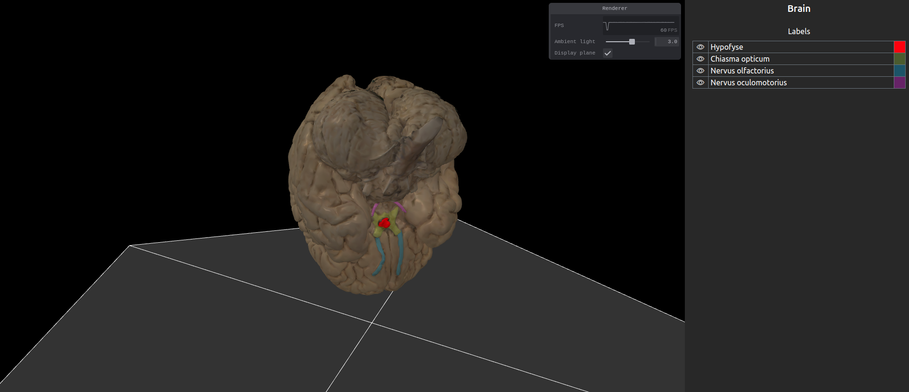

# Open Anatomy Explorer

The Open Anatomy Explorer (OPANEX) is an open-source, web-based anatomy atlas viewer. The platform displays three-dimensional (3D) anatomical models and offers a range of features, including uploading and labelling 3D models, customizing 3D settings, and creating quizzes. Additionally, labeled 3D models can be shared within and between educational institutes by importing and exporting functionalities, facilitating the development of a comprehensive and open-source anatomical library for 3D anatomical models. The OPANEX was created using modern and future-proof web development tools, including Angular using the TypeScript programming language and the use of a WebGL renderer to display 3D models, and offers two separate user interfaces (UI): one for students and one for instructors. An authentication and authorization system, in combination with a back-end, guarantees a secure environment for model annotation and sharing.

